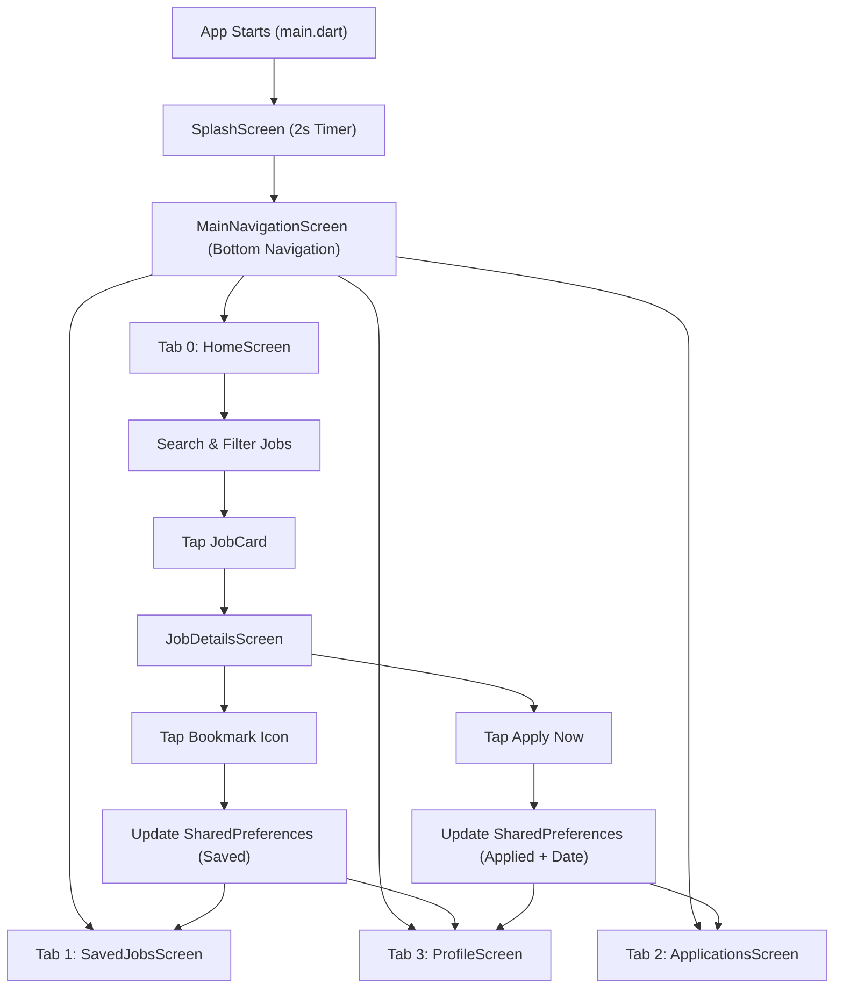

# Beginner's Guide to CareerConnect & Flutter

Welcome! If you already know languages like JavaScript, React, Java, or Python, this guide will help you understand every part of Flutter and how this app works from the ground up.

---

## 1. What is Flutter?
Flutter is an open-source UI toolkit created by Google. 
- In traditional development, you have to write one codebase in Java/Kotlin for Android and a separate one in Swift for iOS.
- With Flutter, you write code **once** in Dart, and Flutter compiles it directly into native machine code for Android, iOS, Web, and Desktop.
- Unlike React Native (which uses a native bridge), Flutter controls every single pixel on screen using its own fast graphics rendering engine.

---

## 2. What is Dart?
Dart is the programming language used to build Flutter apps (also developed by Google).
- If you know Java, Dart feels very familiar: it is **object-oriented**, **strictly typed**, and has classes, methods, and interfaces.
- If you know JavaScript/TypeScript, Dart feels modern: it has `async/await`, arrow syntax (`=>`), and collection methods (`where`, `map`, `any`).
- Dart features **sound null safety**, meaning variables cannot be `null` unless you explicitly mark them with a question mark (e.g., `String?`).

---

## 3. What is a Widget?
In Flutter: **"Everything is a Widget."**
- A widget is a visual or structural building block of your user interface.
- Just like React components (e.g., `<div>`, `<button>`, `<Navbar />`), a Flutter widget describes how a piece of UI should look given its current configuration and state.
- Widgets can be visual elements (like `Text`, `Image`, `Icon`), layout elements (like `Row`, `Column`, `Container`), or functional wrappers (like `GestureDetector`, `Padding`).

---

## 4. What is a StatelessWidget?
A `StatelessWidget` is a widget that **never changes its internal data** once it is created.
- It receives data via constructor arguments and renders it.
- **React comparison**: It is just like a pure, stateless functional component in React that only depends on its `props`.
- **Example in CareerConnect**: `JobCard` and `SearchBarWidget` are `StatelessWidget`s. They take inputs (the job object, callbacks) and draw the UI.

---

## 5. What is a StatefulWidget?
A `StatefulWidget` is a widget that **maintains state that can change** during the user's session.
- When user interaction (such as typing, tapping a filter, or bookmarking) changes the data, the widget needs to rebuild to show the updated information.
- It consists of two classes:
  1. The widget class (which configures the widget).
  2. The `State` class (which holds the mutable variables and the `build()` method).
- **React comparison**: It is like a React component that uses `useState()` or class component state.
- **Example in CareerConnect**: `HomeScreen`, `JobDetailsScreen`, `SavedJobsScreen`, `ApplicationsScreen`, and `ProfileScreen`.

---

## 6. What is `setState()`?
`setState()` is a built-in method in `StatefulWidget` that tells Flutter:
> *"The data has changed! Please re-run the `build()` method so the screen shows the latest data."*

- **React comparison**: It is exactly like calling `setCount(newCount)` in React.
- **Example**:
  ```dart
  setState(() {
    _searchQuery = 'Flutter';
  });
  ```
  Whenever `_searchQuery` updates inside `setState()`, Flutter immediately triggers a re-render and filters the list of jobs shown on screen.

---

## 7. What is `Scaffold`?
`Scaffold` is a standard layout widget from Flutter's Material library.
- It gives your screen a standard visual structure:
  - An `appBar` at the top.
  - A `body` in the middle for your primary content.
  - A `bottomNavigationBar` at the bottom.
  - A floating action button (`floatingActionButton`) if desired.
- Think of `Scaffold` as the blank canvas or skeleton page layout for each screen.

---

## 8. What is `ListView`?
`ListView` is a scrollable column of widgets.
- In mobile development, if a list of 50 items is longer than the phone screen, a regular `Column` will throw a **RenderFlex overflow error**. `ListView` solves this by making the content smoothly scrollable.
- `ListView.builder`: An optimized constructor that builds items **lazily** on-demand only when they are visible on screen. This saves memory and keeps performance buttery smooth.

---

## 9. How does Navigation work?
Flutter uses a **Stack** data structure for screen navigation managed by `Navigator`:
- `Navigator.push()`: Pushes a new screen onto the top of the stack (like opening Job Details). A back arrow appears automatically in the `AppBar`.
- `Navigator.pop()`: Pops the top screen off the stack to go back to the previous screen.
- `Navigator.pushReplacement()`: Replaces the current screen with a new one. In `SplashScreen`, we use `pushReplacement` so the user cannot press the back button and land back on the splash screen.
- In `MainNavigationScreen`, we use `NavigationBar` paired with an `IndexedStack` to switch between the 4 main tabs (Home, Saved, Applications, Profile) without re-creating them from scratch.

---

## 10. How does Search work in CareerConnect?
The search bar listens to what the user types in real-time via `TextField.onChanged`.
1. The text is saved to `_searchQuery`.
2. A Dart getter `_filteredJobs` checks every `Job` in our sample list.
3. It performs case-insensitive comparisons across 4 fields:
   - Does `job.title` contain the keyword?
   - Does `job.company` contain the keyword?
   - Does `job.location` contain the keyword?
   - Does any skill in `job.skills` match the keyword?
4. If yes, the job is kept in the list.
5. If no jobs match, Flutter renders a clean "No opportunities found" state with a reset button.

---

## 11. How does Filtering work?
Filtering uses two layers:
1. **Quick Chips**: Fast toggles for *All*, *Internships*, *Full Time*, and *Remote*.
2. **Extended Modal Sheet**: Allows fine-grained filtering by:
   - **Job Type**: *Internship* vs. *Full Time*
   - **Work Mode**: *Remote*, *Hybrid*, *On-site*
   - **Location**: *Pune*, *Mumbai*, *Bengaluru*, *Remote*
3. Both conditions combine logically (`AND` operation) in `_filteredJobs`. If any condition fails, that job is omitted from the visible list.

---

## 12. How does `SharedPreferences` work?
`SharedPreferences` is a key-value local storage system:
- On Android, it writes to an XML file (`Shared Preferences`).
- On iOS, it writes to `NSUserDefaults`.
- On Web/Chrome, it writes to browser `localStorage`.
- **React comparison**: It is the Flutter equivalent of `localStorage.getItem()` and `localStorage.setItem()`.
- Data stored here persists even when the user closes the app or reboots their phone.

---

## 13. How is Job data stored?
- In `lib/models/job.dart`, we define a strongly typed class `Job` with properties: `id`, `title`, `company`, `location`, `jobType`, `workMode`, `salary`, `description`, `responsibilities`, `requirements`, and `skills`.
- In `lib/data/sample_jobs.dart`, we define a static list of 12 realistic job objects.
- In `lib/services/storage_service.dart`, we store **only the IDs and timestamps**:
  - Saved jobs: `['job_001', 'job_003']` stored as a JSON/String list.
  - Applied jobs: `{"job_001": "05 Oct 2026"}` stored as a JSON string.
- This is efficient because we do not duplicate full job texts in local storage.

---

## 14. How does Save Job (Bookmarking) work?
1. User taps the bookmark icon on any `JobCard` or in `JobDetailsScreen`.
2. The app calls `StorageService.toggleSavedJob(job.id)`.
3. If the ID exists in the saved list, it gets removed; if not, it gets added.
4. The list is written to `SharedPreferences`.
5. `setState()` runs to immediately update the bookmark icon color (filled primary color vs. outline).
6. A floating `SnackBar` provides instant feedback to the user.
7. The `SavedJobsScreen` reads these saved IDs to display only bookmarked jobs.

---

## 15. How does Apply work?
1. User opens a job and taps **"Apply Now"**.
2. The app calls `StorageService.applyJob(job.id)`.
3. It captures today's date (e.g., `"05 Oct 2026"`).
4. The job ID and date are saved into `SharedPreferences`.
5. The button immediately changes into a disabled, green-accented **"Applied"** state to prevent duplicate submissions.
6. A success message appears: *"Application saved successfully."*
7. The `ApplicationsScreen` displays the job under "My Applications" with an "Applied" badge and date.
8. The `ProfileScreen` increments the "Applied Jobs" metric counter.

---

## 16. Complete Project Flow


1. **Bootstrap**: `main()` initializes Flutter bindings and launches `CareerConnectApp`.
2. **Splash**: Shows app branding and transitions after 2 seconds to `MainNavigationScreen`.
3. **Shell**: `MainNavigationScreen` houses the 4 tabs and keeps live count badges.
4. **Browsing**: On `HomeScreen`, students search by keyword or filter by location, work mode, and job type.
5. **Details**: Tapping any card opens `JobDetailsScreen` showing full requirements and responsibilities.
6. **Actions**:
   - Bookmark toggles local saved state.
   - Apply saves application date and marks job as applied.
7. **Tabs**:
   - `SavedJobsScreen` displays bookmarked jobs.
   - `ApplicationsScreen` displays submitted applications.
   - `ProfileScreen` displays student credentials and live statistics.
